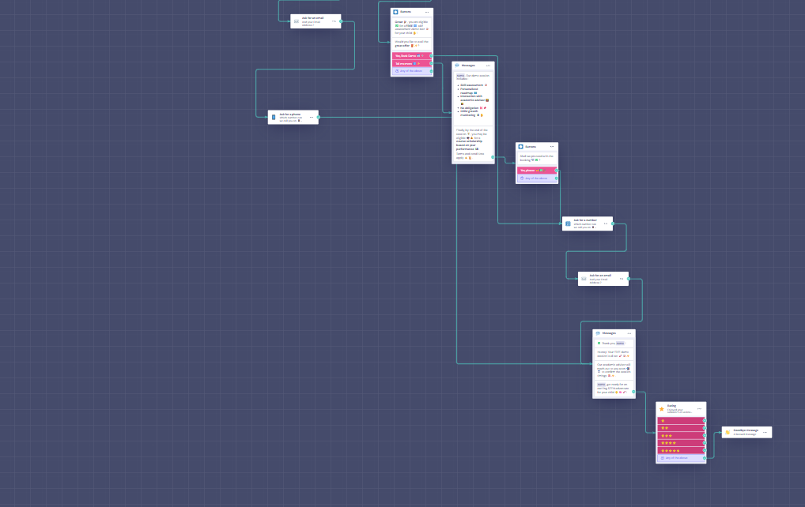

🚀 WizKlub Conversion-Focused Chatbot Prototype
📌 Project Overview

This project involved designing and deploying a conversion-driven chatbot prototype for WizKlub.com with a clear objective:

  >Transform passive website visitors into qualified, intent-driven leads.

WizKlub serves two primary customer segments:

  >👨‍👩‍👧 Parents exploring structured STEM programs for their children

  >🏫 Schools interested in long-term partnership programs

A key business challenge identified was that a significant portion of website traffic exited without meaningful interaction or conversion.

This chatbot was built as a pre-sales qualification and engagement funnel to address that gap.

🎯 Product Objective

Instead of functioning as a generic informational assistant, the chatbot was designed to:

  >Identify visitor intent early

  >Segment users accurately

  >Qualify leads progressively

  >Reinforce value before asking for commitment

  >Drive demo bookings and partnership discussions

🔁 Funnel Architecture

The chatbot follows a structured engagement flow:

Visitor
   ↓
User Segmentation (Parent / School)
   ↓
Qualification Questions
   ↓
Value Reinforcement
   ↓
Lead Capture
   ↓
Call-to-Action (Demo / Meeting Booking)

Why This Structure?

This mirrors a real-world sales funnel:

  Awareness → Interest → Qualification → Intent → Conversion

It ensures:

  >Personalization

  >Reduced friction

  >Higher probability of demo booking

🧠 Key Design Decisions
1️⃣ Segmentation-First Approach

The chatbot immediately identifies whether the visitor is:

  >A Parent

  >A School Representative

Impact:

  >Audience-specific messaging

  >Relevant qualification questions

  >Increased engagement due to personalization

  >Early segmentation prevents irrelevant questioning and reduces drop-offs.

2️⃣ Progressive Qualification (Micro-Commitment Strategy)

Instead of immediately requesting contact details, the chatbot first asks low-friction questions such as:

  >Grade level

  >Interest area

  >Role in school

  >School size

Product Thinking Behind This:

  >Builds psychological commitment

  >Creates engagement momentum

  >Establishes trust before lead capture

  >Each interaction deepens involvement gradually.

3️⃣ Value Reinforcement Before Lead Capture

Before requesting personal information, the chatbot clearly communicates program benefits.

For Parents:

  >Skill assessment

  >Personalized learning roadmap
  
  >Academic advisor interaction

For Schools:

  >Structured curriculum integration

  >Partnership-based institutional growth

  >STEM capability development support

This ensures users understand the value exchange before being asked to convert.

4️⃣ Conversion-Optimized Call-to-Action

The chatbot uses clear and direct CTAs:

  >“Book a FREE Skill Assessment Demo”

  >“Schedule a Partnership Discussion”

Strong, simple CTAs reduce decision fatigue and improve action rates.

5️⃣ Low-Friction Lead Capture

Contact details (Name, Phone, Email) are collected only after intent is established.

Validation-enabled input fields ensure:

  >Accurate data capture

  >Sales-ready, actionable leads

📊 Metrics & Success Measurement

To evaluate performance, the following KPIs were identified:

1. Chat Start Rate

  Measures visitor engagement with the chatbot.

  Chat Starts ÷ Total Website Visitors × 100

2. User Segmentation Distribution

Tracks proportion of:

  >Parent users

  >School representatives

Helps understand traffic intent mix.

3. Qualification Completion Rate

Indicates engagement depth and funnel strength.

4. Lead Capture Rate
Leads Captured ÷ Total Chat Starts × 100

5. Demo Booking Conversion Rate (Primary KPI)

Percentage of qualified leads who schedule a demo or meeting.

6. Drop-Off Analysis

Used to optimize:

  >Question order

  >Messaging clarity

  >CTA placement

7. Response Time to Lead

Faster follow-ups increase booking probability.

🛠 Tech Stack

Platform: Landbot

Deployment: Live shareable link

Design Focus: Conversion psychology + Product funnel thinking

🔗 Live Prototype

You can test the chatbot here:

👉 https://landbot.online/v3/H-3335145-CUWVDILJT7JWN94I/index.html

💼 What This Project Demonstrates

Product thinking aligned with business goals: 

  >Conversion funnel design

  >User segmentation strategy

  >Lead qualification frameworks

  >Sales-process alignment

  >UX decisions backed by behavioral psychology

  >KPI-driven performance planning

Screenshots 

